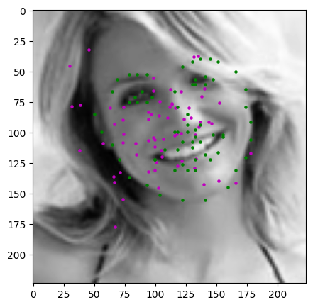
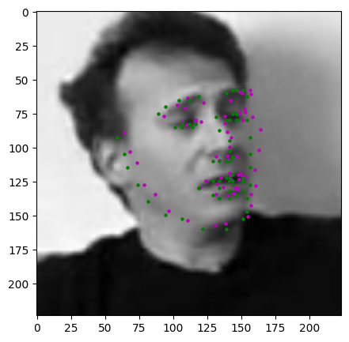
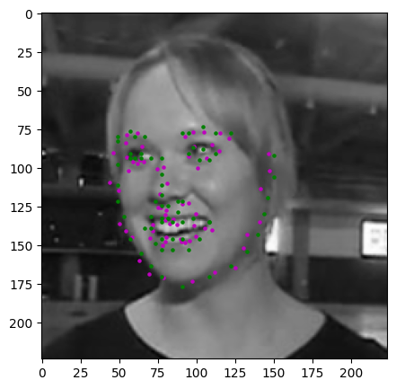
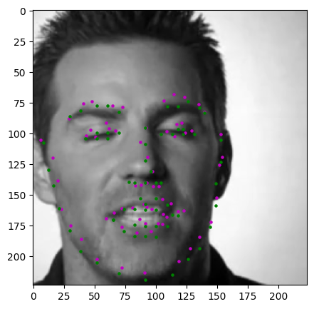
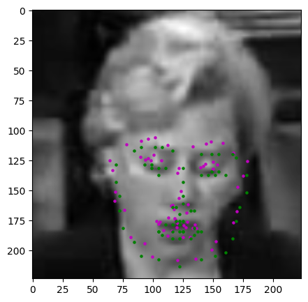
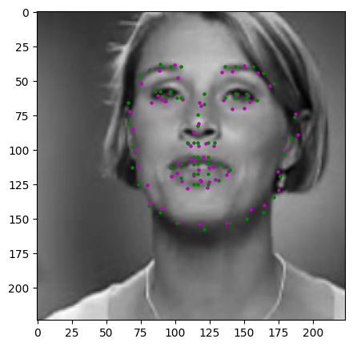
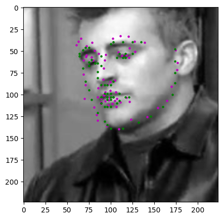

In this [experiment](G_Facial_keypoint_detection.ipynb), I implemented a convolutional neural network to detect 68 keypoints on a face, based on the starting code, instructions, utility functions and training data from Udacity's [Computer Vision](https://www.udacity.com/course/computer-vision-nanodegree--nd891) nanodegree.

The training data provided by Udacity includes thousands of facial images that come with 68 keypoints for each face (for example, eyebrows, eyes, mouth, nose bridge and jaw).

This is a regression task, and the convolutional neural network outputs 68 x, y-coordinates that should be as close as possible to the 68 ground-truth keypoints. Thus, loss function is MSE loss function. 

I used a pre-trained EfficientNet model as feature extractor, and only trained the final layers of the network to compute the keypoint coordinates based on those features.

Here's an example of 68 keypoints on sample facial images:

# Results

Before training, the model output 68 x- and y- coordinates but they represent random points.

After 45 epochs, the 68 output keypoints closely resemble the ground-truth keypoints from Udacity's dataset.

The model can still predict keypoints when the eyes are closed.

On testing images, the predicted keypoints are also close to the ground-truth keypoints, like in the image below of Joey Tribbiani with his eyes closed.

